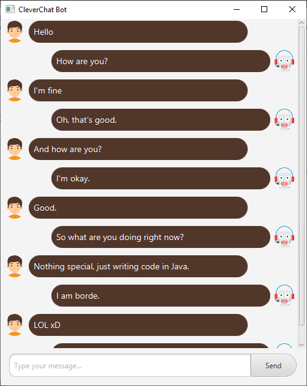

# FXCleverBot
Chat with [CleverBot](https://www.cleverbot.com) on JavaFX. The application uses [HtmlUnit](https://github.com/HtmlUnit/htmlunit) to parse the [CleverBot](https://www.cleverbot.com).
 If you have any questions - welcome to [issues](https://github.com/xISRAPILx/FXCleverBot/issues).

